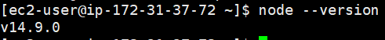
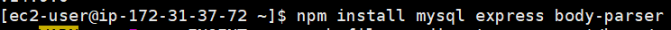

EC2의 linux 환경에서 node설치 방법이다.


EC2의 linux 환경에서 node설치 방법에 대해 알아보자

설치 과정은 다음과 같다.

1. nvm (Node Version Manager) 설치

```sh
$ curl -o- https://raw.githubusercontent.com/nvm-sh/nvm/v0.34.0/install.sh | bash
```

2. nvm 사용할 수 있도록 실행

```sh
$ . ~/.nvm/nvm.sh
```

3. nvm으로 node 설치

```sh
$ nvm install node
```

<br/>

최신버전으로 설치된 node를 확인할 수 있다.



<br/>

이제 본인이 필요한 node 모듈을 설치해주자. 난 추후 포스트에서 python과 RDS의 데이터 송수신을 담당할 node 스크립트를 작성해야 하므로, 필요한 모듈 mysql, express, body-parser를 설치했다.

```sh
$ npm install [본인이 설치할 모듈 이름]
```



참고로 여기서 설치한 mysql은 node와 RDS의 mysql을 연결해주는 것이다. 인스턴스에서 mysql에 직접 접속하고 싶으면 [EC2인스턴스 RDS  MySql접속]()에서 확인하자.