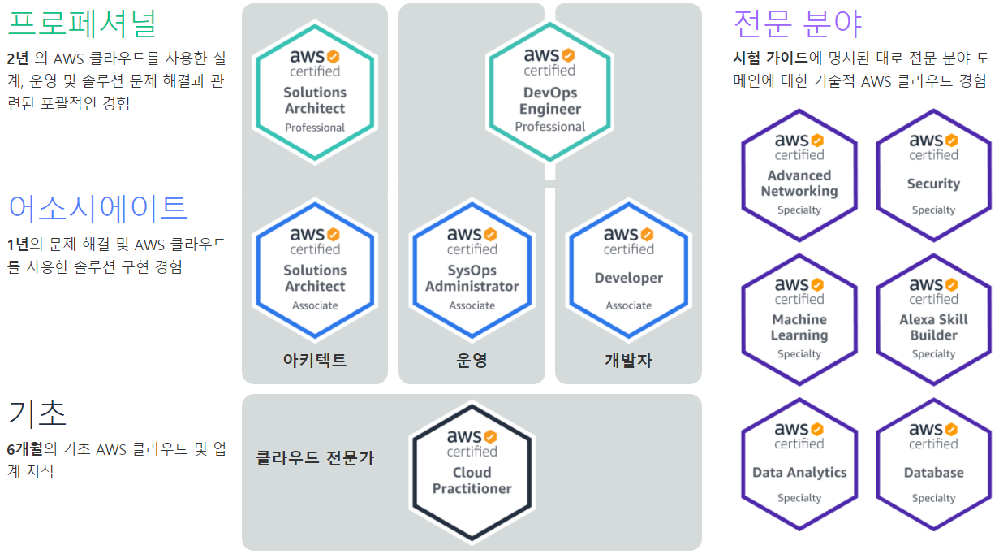
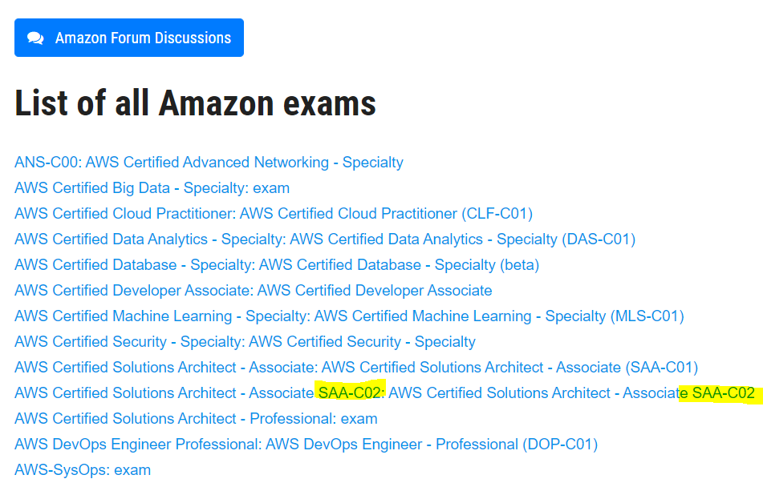
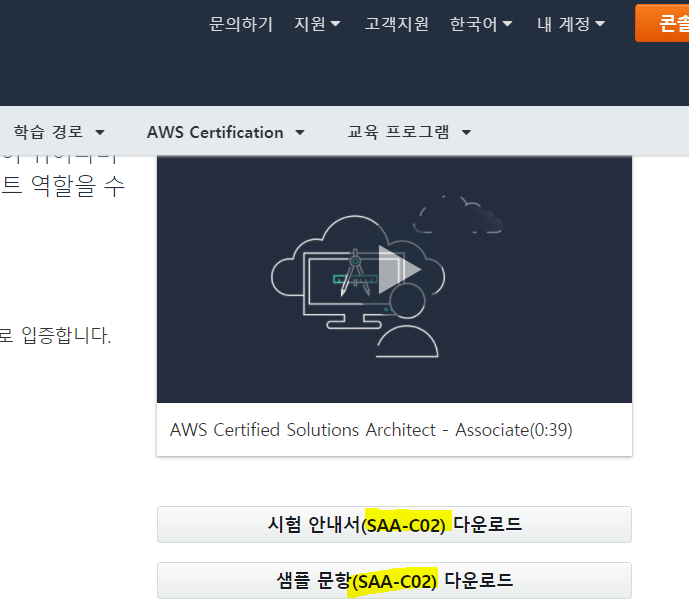
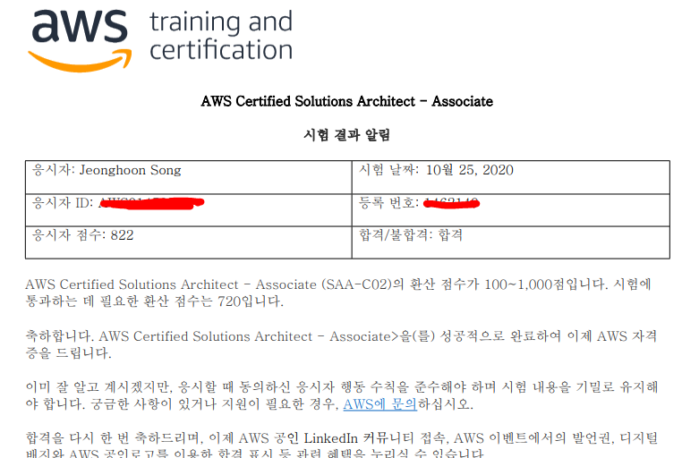
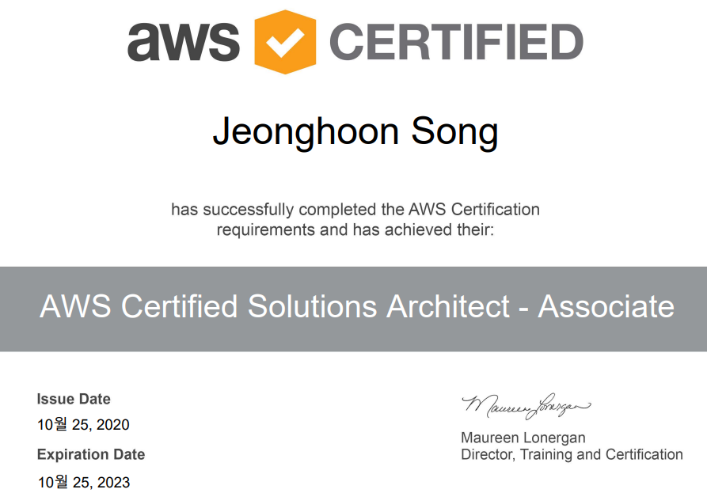

AWS(Amazon Web Service)에서는 본인들의 서비스에 대한 다음의 자격증을 발급한다. 생각보다 시험비가 싸지 않으므로 본인의 목적에 맞게 준비하고 취득하는 것이 좋아보인다.

- Practitioner  -100$
- **Associate - 150$**
- Professional - 300$
- Specialty - 300$

같이 공부한 친구와 함께 목표했던 `AWS Solutions Architect - Associate`(SAA) 를 취득할 수 있었다. 답만 외웠던 `Practitioner`와 달리 SAA는 아키텍처의 문제에 대한 해결을 내놓는 것이 주된 요구사항이었기 때문에, 몇몇 문제에 대한 솔루션을 직접 구축해보기도 하였다.

 

`Practitioner`와 마찬가지로 https://www.examtopics.com/exams/amazon/에서 기출문제를 공부했다.

아래 목록에서 본인이 볼 시험에 맞는 문제를 선택하면 된다.

참고로 각 시험마다 일련번호가 부여 되어 있기 때문에 그에 맞는 덤프를 풀면 된다. 일련번호마다 문제 pool이 다르다. 다음은  `AWS Solutions Architect - Associate`  의 예이다. Aws에서 현재 문제의 일련번호를 확인 후 그에 맞는 문제를 풀자.

 

시험은 한글로 보는 것을 권장한다. 한글로 보면 한글 번역본 뿐만 아니라 영어 원문도 볼 수 있기 때문이다.

합격하면 그 자리에서 합/불합을 확인할 수 있고, 5일 이내에 아래와 같이 문서로 확인할 수 있다. 난 1일 지나고 확인가능했다.

 

