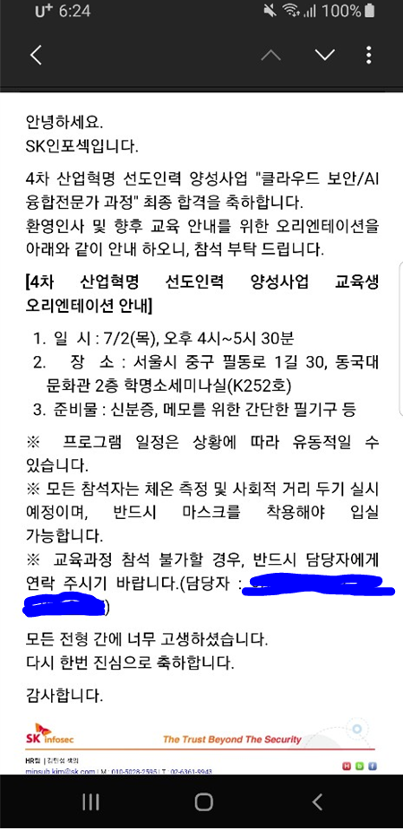

삼성 멀티캠퍼스에서 6개월 간의 클라우드 MSA 교육이 끝나고 3일 뒤에 바로 SKCT를 봤다. 주말이 껴 있었기 때문에 문제집이 시험 전 날 도착했다. ''이건 망했다'' 하고 마음 놓고 시험봤는데, 덜컥 붙어버렸다. 

결과 나오고 바로 다음주에 AI면접으로 한번 더 거르고

합격했다.

오리엔테이션 바로 다음날부터 교육에 들어갔다.

기존에 합격해 놓았던 42서울 입과를 취소하고 바로 교육을 받을 준비를 했다.

 

하지만 걱정도 있다. 만약 입사하게 되면 대부분의 신입은 보안관제부터 시작한다. 

무엇인가 지키는 것도 좋지만, 나는 생산적인 일을 할 때 더욱 보람을 느낀다. 

때문에 내가 이 일을 계속 할 수 있을까라는 생각이 들었다. 

뭐 여차저차해서 결론은, 아직 실무에서 뛰어보지도 않았고 보안업계가 보안직종만 있지 않기 때문에, 

이 분야에서 나만의 보람을 찾도록 노력하는게 최선이라는 생각한다(보안이 재밌을 수도 있으니까 ㅎㅎ).